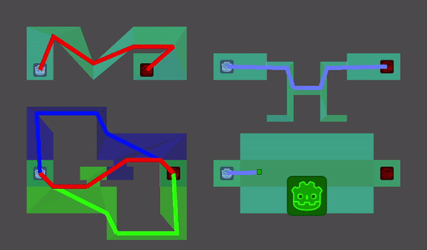

# Godot NavigationServer Example

4 Demos básicas de usos para el NavigationServer de Godot 3.5

De arriba a abajo, izquierda a derecha:

* Navegación en mapa estático
* Navegación en mapas por capas
* Navegación en mapa dinámico
* Navegación con obstáculos

## Navegación estática

Se utiliza un [NavigationPolygonInstance](https://docs.godotengine.org/en/3.5/classes/class_navigationpolygoninstance.html) y con una llamada a [Navigation2DServer](https://docs.godotengine.org/en/3.5/classes/class_navigation2dserver.html) se calcula el path durante la ejecuión de `_ready`, que luego se muestra gráficamente con un [Line2D](https://docs.godotengine.org/en/3.5/classes/class_line2d.html).

## Navegación por capas

Solo difiere de la versión estática por el uso de varios `NavigationPolygonInstance` que utilizan [Navigation Layers](https://docs.godotengine.org/en/3.5/classes/class_navigationpolygoninstance.html#class-navigationpolygoninstance-property-navigation-layers) distintos, y luego se piden 3 paths distintos (un path por cada capa y otro que usa ambas).

## Navegación en mapa dinámico

En este caso se pide el path en cada ejecución de `_physics_process`, y la región en movimiento se anima con el uso de un [Tween](https://docs.godotengine.org/en/3.5/classes/class_scenetreetween.html#class-scenetreetween).

## Navegación con obstáculos

Este caso usa [NavigationAgent2D](https://docs.godotengine.org/en/3.5/classes/class_navigationagent2d.html) y [NavigationObstacle2D](https://docs.godotengine.org/en/3.5/classes/class_navigationobstacle2d.html).
Se usa un `Tween` nuevamente para animar el obstáculo.

El proceso es el siguiente:
1. Asignar el objetivo con el método [set_target_location](https://docs.godotengine.org/en/3.5/classes/class_navigationagent2d.html#class-navigationagent2d-method-set-target-location)
1. Recibir el siguiente punto objetivo con [get_next_location](https://docs.godotengine.org/en/3.5/classes/class_navigationagent2d.html#class-navigationagent2d-method-get-next-location) y usarlo para calcular la velocidad deseada.
1. Enviar la velocidad deseada con [set_velocity](https://docs.godotengine.org/en/3.5/classes/class_navigationagent2d.html#class-navigationagent2d-method-set-velocity)
1. Esperar la señal [velocity_computed](https://docs.godotengine.org/en/3.5/classes/class_navigationagent2d.html#class-navigationagent2d-signal-velocity-computed) y utilizar la velocidad segura computada para mover al agente